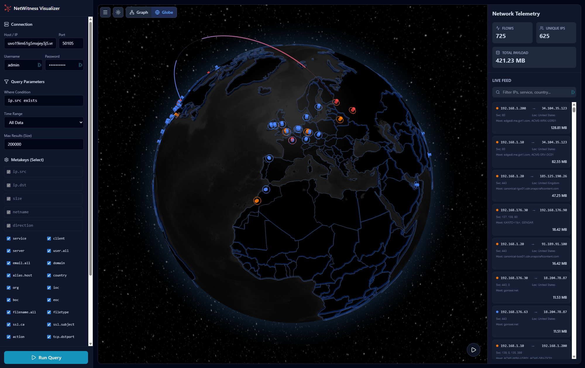
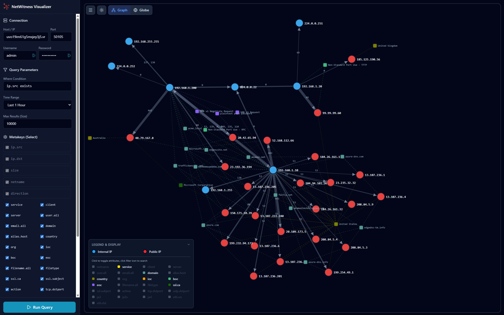
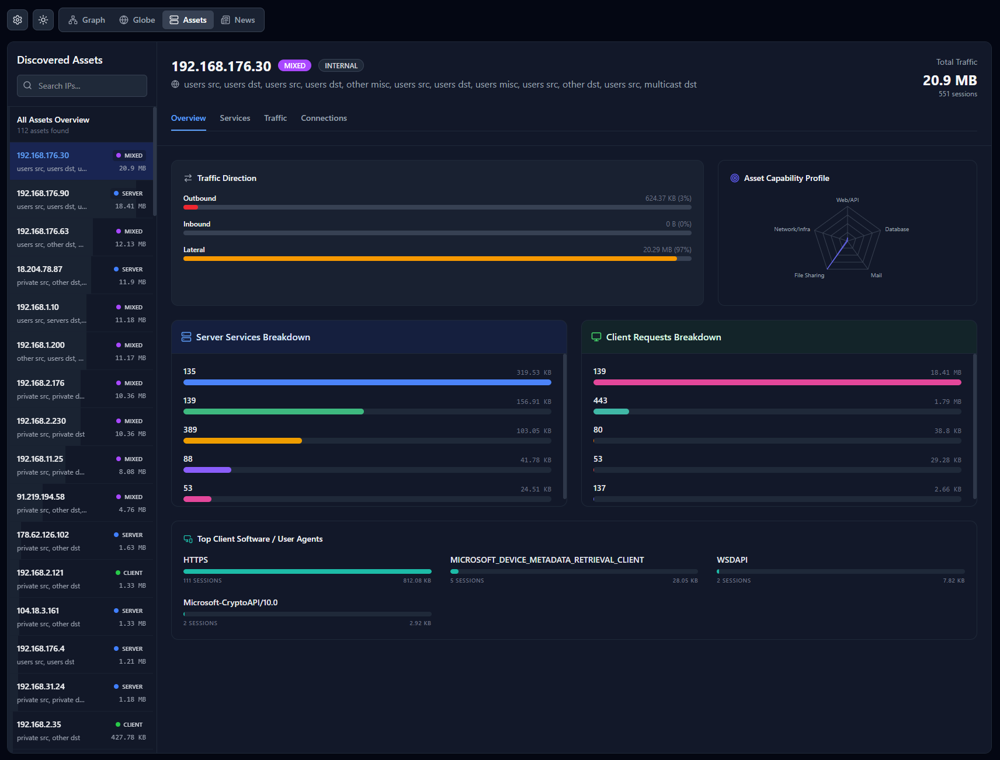
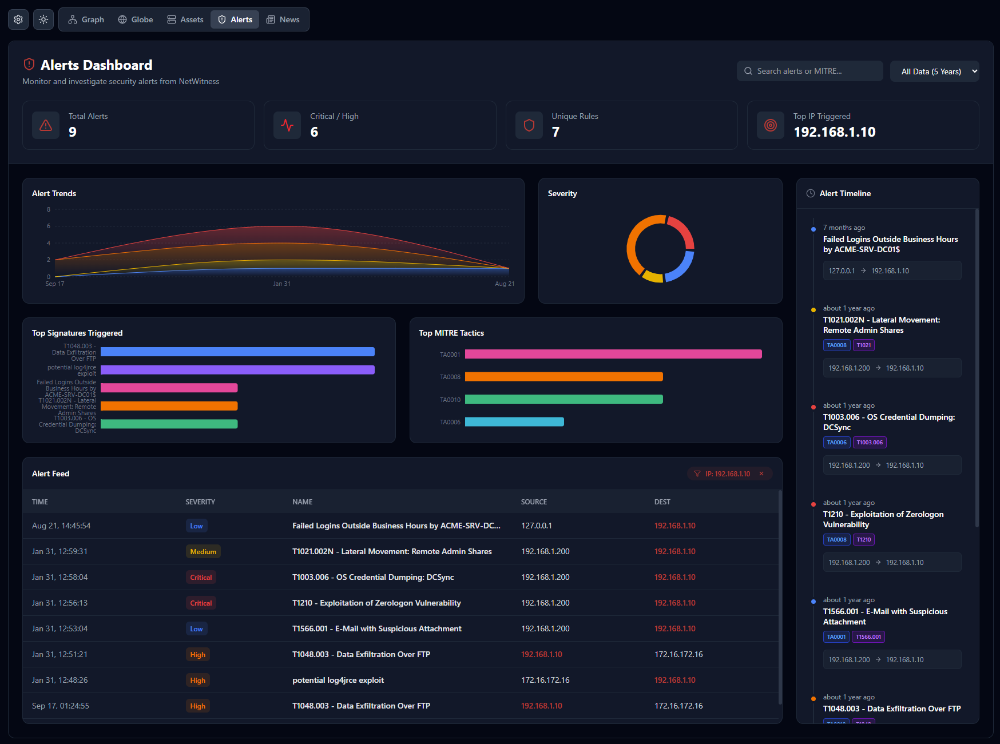
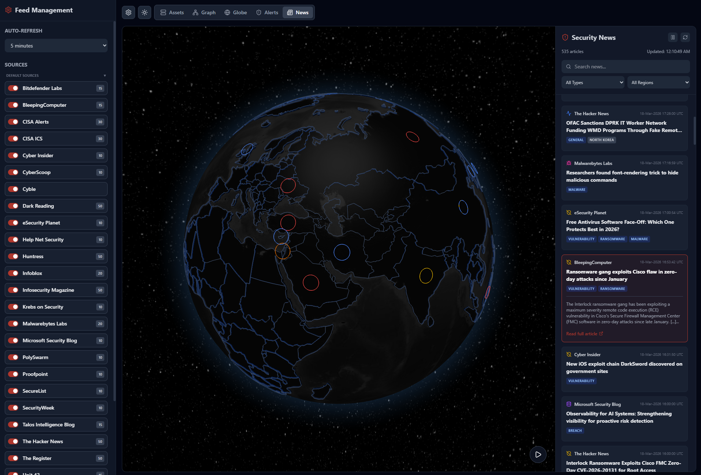

# NetWitness Visualizer Dashboard

This is a custom dashboard built to visualize data from NetWitness. The dashboard features five distinct modes: **Globe**, **Graph**, **Assets**, **Alerts**, and **News**, allowing you to explore your queried dataset from multiple perspectives.

-----

## 📊 Preview & Features

### Globe Dashboard

This dashboard represents queried data on an interactive 3D globe. Clicking on values from the globe or the right panel expands the view with more details.


**Key Features:**

  * **Home Location:** To visualize connections, set a "Home Location" for internal/private IPs. This can be done by `Shift + Right-Clicking` on the globe, configuring it in the `.env` file, or manually overwriting the Latitude/Longitude in the left panel.
  * **Animation Control:** Pause or resume the globe animation using the play/pause icon in the bottom right corner.
  * **Session Visualization:** The height of the pillar displayed on the globe for a given IP is relative to the number of sessions.
  * **Text Filtering:** Filter sessions dynamically. For example, typing `goo` includes sessions containing "goo", while `!goo` excludes them.
  * **Threat Focus:** Check the "Threats" box to exclusively show sessions containing an IoC, BoC, or EoC.
  * **Sorting:** Order sessions chronologically or by size.
  * **NetWitness Navigate Integration:** Click the icon next to a meta value to jump directly to NetWitness Navigate for that value (requires configuring the "Navigate Base URL").
  * **Shodan Integration:** Click the icon next to a public IP address to instantly open Shodan for that IP.
  * **Auto-Refresh:** Enable "Auto-refresh query" from the left panel to pull new data at regular intervals.

### Graph Dashboard

This dashboard represents the queried data in an interactive node diagram, visualizing connections and relationships between different IPs and attributes. Clicking on any value expands a view with additional node details.


**Key Features:**

  * **Dynamic Refocus:** Click on meta values from the right panel to dynamically update and refocus the graph.
  * **NetWitness Navigate Integration:** Instantly jump to NetWitness Navigate by clicking the icon next to a meta value.
  * **Customizable Metakeys:** Add or remove metakeys from the graph using the “Legend & Display” box. You can also add custom metakeys not queried by default via the “Custom Metakeys” box.
  * **Proportional Sizing:** Node size is relative to the number of sessions associated with that meta value.
  * **Inline Filtering:** Within the “Legend & Display” box, click the filter icon next to any metakey. For example, entering `goo` in the `org` metakey filters for "goo", while `!goo` excludes it.
  * **Auto-Refresh:** Automatically refresh data at regular intervals via the left panel toggle.

### Assets Dashboard

This dashboard displays information around discovered assets within the queried dataset. It helps visualize attributes, categorizations, and profiling of assets based on the data.


### Alerts Dashboard

This dashboard displays alerts data from the NetWitness Respond service.


**Key Features:**

  * **Alert Timeline:** Clicking an IP address from the "Alert Feed" updates the timeline to show all related alerts in chronological order.
  * **Deep Dive:** Clicking on an alert (from either the feed or timeline) reveals detailed information about that specific alert.

### News Dashboard

This dashboard provides a news feed from RSS sources (it does not pull data from NetWitness).


**Key Features:**

  * **RSS Management:** Enable, disable, or add custom RSS sources directly from the left side panel. Default sources can be managed by editing the `rss-feeds.json` file.
  * **Auto-Refresh:** Set custom frequencies for automatic RSS feed refreshes.
  * **Data Limits:** By default, the feed consumes a maximum of 50 articles per RSS source.
  * **Advanced Filtering:** Filter articles by country/region (using the dropdown or clicking the globe) or by text (e.g., `goo` to include, `!goo` to exclude).

-----

## ⚙️ Installation

The dashboard can be installed directly on an existing NetWitness Server, or on standalone Linux/Windows machines.

### Option 1: Install on NetWitness

Execute the following commands in your NetWitness server terminal:

```bash
# Install Node.js
curl -fsSL https://rpm.nodesource.com/setup_22.x | sudo bash -
dnf install nodejs -y

# Configure Firewall
edit /etc/sysconfig/iptables 
# Add this line: -A INPUT -p tcp -m tcp -m multiport --dports 3000 -m comment --comment "netwitness-visualizer" -m conntrack --ctstate NEW -j ACCEPT
systemctl restart iptables

# Extract and Install
unzip netwitness-visualizer.zip
cd netwitness-visualizer
# Note: Edit the .env file with your environment details before running npm install
npm install
npm run dev
```

Access the app at: `http://<ip_address>:3000`

### Option 2: Install on Linux

```bash
unzip netwitness-visualizer.zip
cd netwitness-visualizer
# Note: Edit the .env file with your environment details
sudo apt install nodejs npm
npm install
npm run dev
```

Access the app at: `http://<ip_address>:3000`

### Option 3: Install on Windows

1.  Download and install `nvm-setup.exe`.
2.  Open your terminal or command prompt and run:
    ```cmd
    nvm install lts
    nvm use lts
    ```
3.  Unzip `netwitness-visualizer.zip` and navigate to the folder.
4.  Edit the `.env` file and add your environment details.
5.  Run the following commands:
    ```cmd
    npm install
    npm run dev
    ```
6.  Access the app at: `http://<ip_address>:3000`

-----

## 🛠 Configuration

### Environment Variables (`.env`)

Default settings can be securely managed by editing the `.env` file in the root directory.

| Variable | Description |
| :--- | :--- |
| `VITE_NW_HOST` | IP or Hostname of the Concentrator/Broker |
| `VITE_NW_PORT` | TCP Port (50105 for Concentrators, 50103 for Brokers) |
| `VITE_NW_USERNAME` | NetWitness Username |
| `VITE_NW_PASSWORD` | NetWitness Password |
| `VITE_NW_ALERTS_HOST` | Admin Server's IP or Hostname |
| `VITE_NW_ALERTS_PORT` | Admin Server Port (Typically `443`) |
| `VITE_NW_ALERTS_USERNAME` | Admin Server Username |
| `VITE_NW_ALERTS_PASSWORD` | Admin Server Password |
| `VITE_NW_HOME_LAT` | Default Latitude for the "Home" private IP location (Globe view) |
| `VITE_NW_HOME_LNG` | Default Longitude for the "Home" private IP location (Globe view) |
| `VITE_NW_NAVIGATE_URL` | Base URL for NetWitness Investigate (e.g., `https://192.168.1.111/investigation/6/navigate/`) |

**Enable/Disable Dashboards:**
Set the following variables to `true` or `false` to toggle specific dashboard views:

  * `VITE_ENABLE_ASSETS`
  * `VITE_ENABLE_GRAPH`
  * `VITE_ENABLE_GLOBE`
  * `VITE_ENABLE_ALERTS`
  * `VITE_ENABLE_NEWS`

### News Dashboard RSS Feeds

You can permanently change or add RSS sources used by the News dashboard by modifying the `rss-feeds.json` file.

### Integration with NetWitness UI

Specific dashboards can be accessed and parameterized directly via the URL.

**URL Parameter Structure:**
`http://<dashboard_ip>:3000/?query=ip.all=192.168.1.1&timerange=24h&size=1000&view=globe`

  * `query`: The specific query to execute.
  * `timerange`: The timeframe to query (e.g., `24h`).
  * `size`: Maximum number of results to return.
  * `view`: The target dashboard (`globe`, `graph`, `assets`, `alerts`, or `news`).

**Creating Custom Right-Click Actions in NetWitness:**
You can use these parameters to create custom context menu actions in the NetWitness UI, allowing you to seamlessly pivot to the visualizer for a specific IP.

1.  In NetWitness, navigate to **Admin \> System \> Context Menu Actions**.
2.  Create a new action using the following URL format (`{0}` acts as a wildcard for the clicked value):
    `http://10.10.10.29:3000/?query=ip.all={0}&timerange=24h&size=1000&view=globe`
3.  Change the `view=` parameter to `graph` or `globe` depending on which visualizer you want to open by default.

-----

